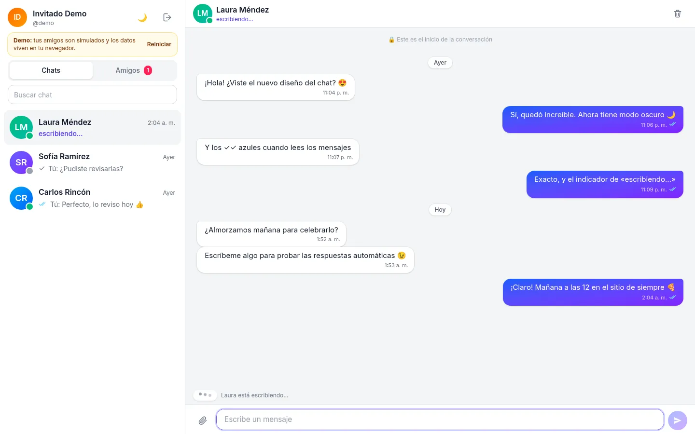
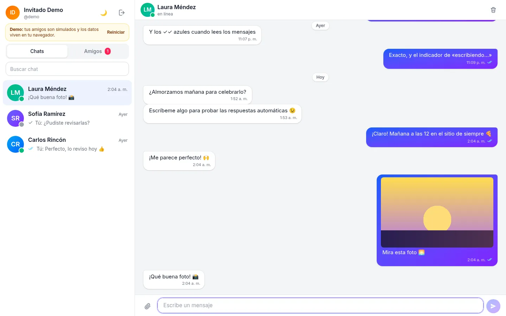
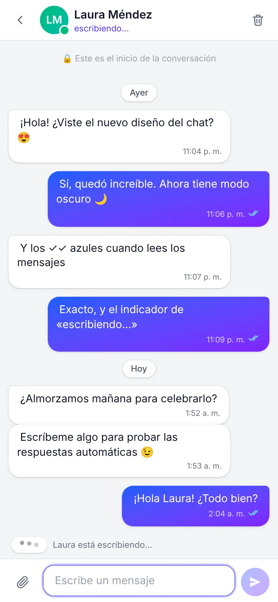
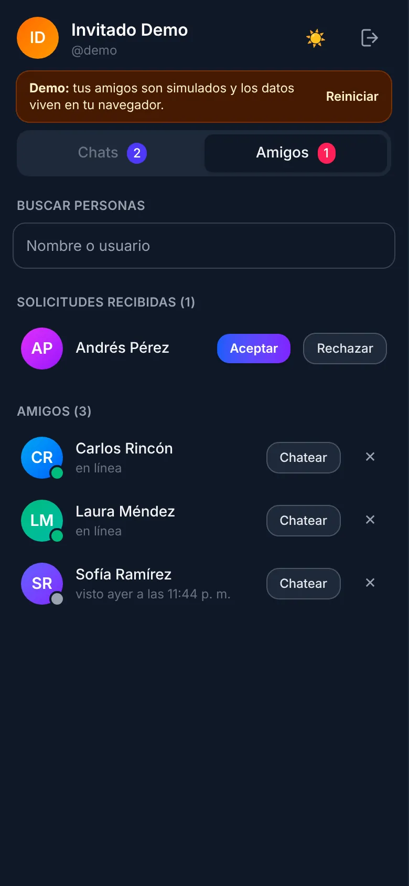
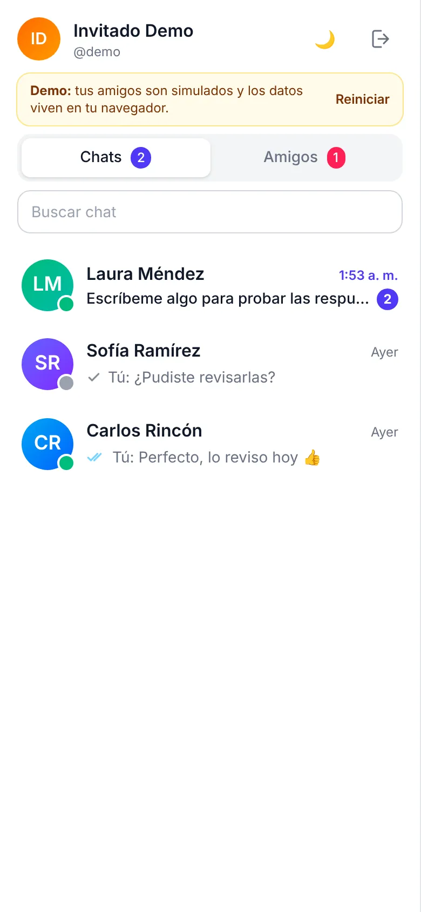
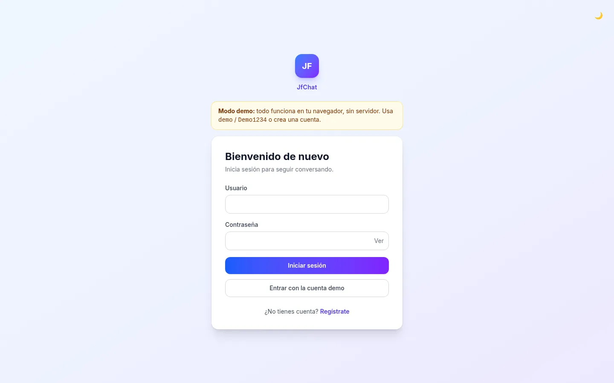
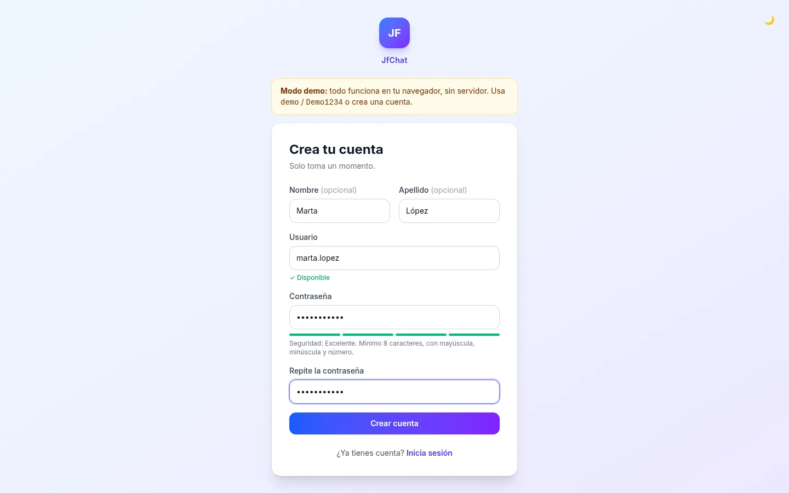
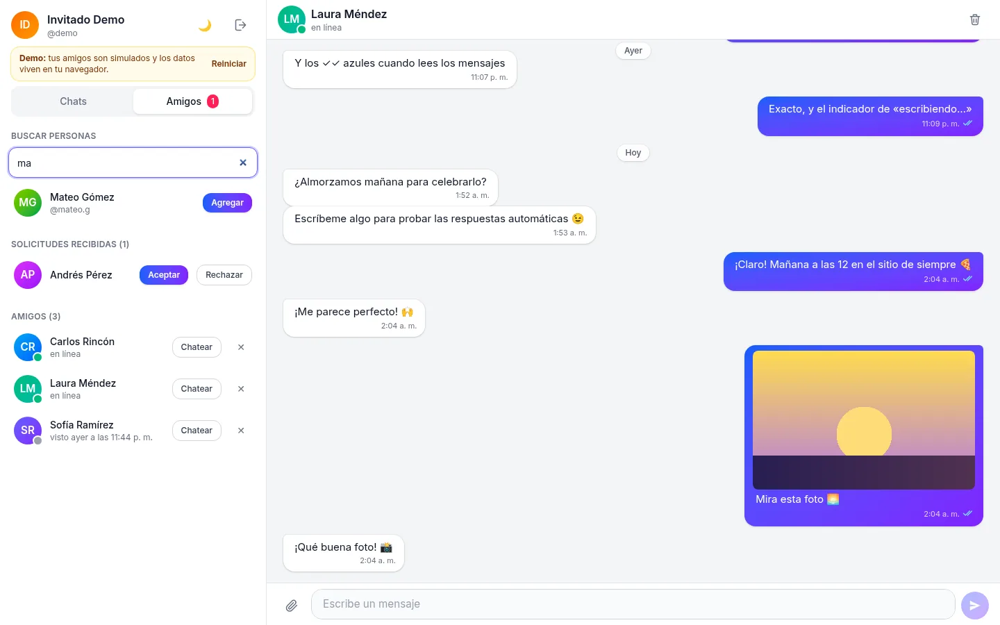
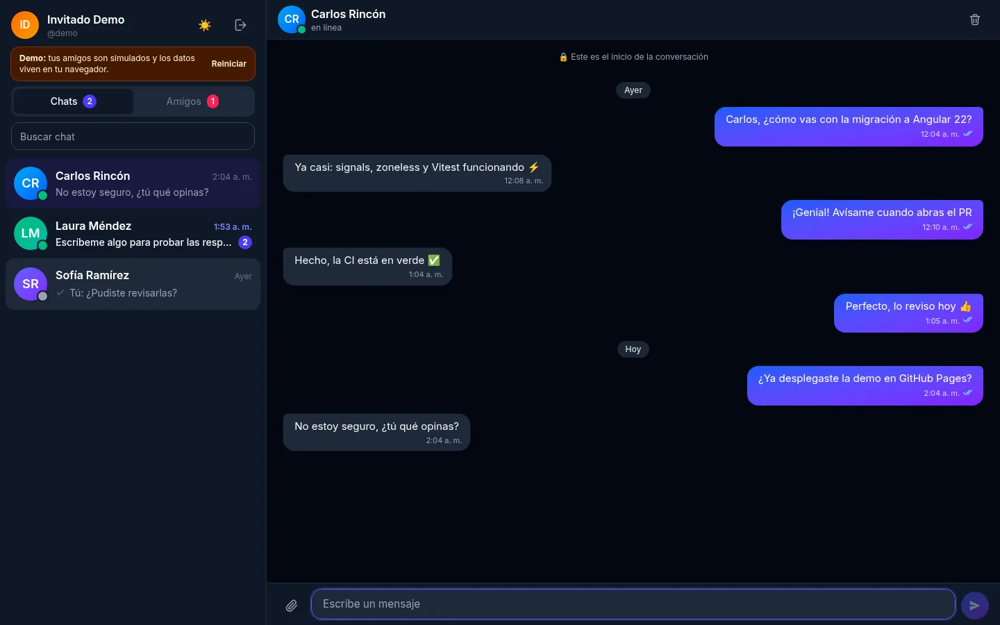
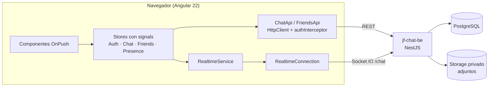

# JfChat

Chat en tiempo real hecho con **Angular 22** (signals, zoneless) y **NestJS + Socket.IO + PostgreSQL**. Tiene mensajes al instante, indicador de «escribiendo…», presencia en línea, confirmaciones de entrega y lectura (✓ ✓✓ ✓✓ azul), adjuntos privados, modo oscuro y diseño responsive, todo en español.

**▶ Demo en vivo: https://jfredmc.github.io/jf-chat/** (botón «Entrar con la cuenta demo» o `demo` / `Demo1234`)

> La demo funciona **sin servidor**: un backend simulado corre dentro de tu navegador, con amigos que responden, escriben y leen. Tus datos se guardan solo en tu navegador (`localStorage`) y el botón «Reiniciar» los borra.

[](https://github.com/JFredMC/jf-chat/actions/workflows/ci.yml)
[](https://github.com/JFredMC/jf-chat/actions/workflows/deploy.yml)

| Conversación en tiempo real | Adjuntos y respuestas |
|---|---|
|  |  |

| Móvil | Móvil (oscuro) | Lista de chats |
|---|---|---|
|  |  |  |

<details>
<summary>Más capturas</summary>

| Inicio de sesión | Registro |
|---|---|
|  |  |

| Amigos y solicitudes | Modo oscuro |
|---|---|
|  |  |

</details>

## Funcionalidades

**Mensajería**
- Mensajes al instante por WebSocket, con *acknowledgement* y respaldo por REST si el socket no responde.
- Envío optimista: el mensaje aparece al momento, con estados **enviando → ✓ enviado → ✓✓ entregado → ✓✓ azul leído**. Si falla, ofrece **Reintentar** o **Descartar**, y el reintento nunca lo duplica (`client_id` idempotente).
- «Laura está escribiendo…» en el encabezado, en la lista y sobre el cuadro de texto.
- Presencia: «en línea» o «visto hace 5 minutos», solo visible para amigos y contactos.
- Historial con scroll infinito (conserva la posición), separadores por día y botón «ir al final» con contador de mensajes nuevos.
- Contador de no leídos en cada chat y en el título de la pestaña: `(3) JfChat`.
- Los enlaces `http(s)` se convierten en links seguros. El contenido nunca se inserta como HTML, así que no hay riesgo de XSS.
- Adjuntos (imágenes, PDF y texto, hasta 10 MB) con barra de progreso y vista previa; también puedes pegar una captura con Ctrl+V. Los archivos son privados y se abren con URLs firmadas que caducan en 5 minutos.

**Cuenta y amigos**
- Registro con disponibilidad de usuario en vivo, medidor de seguridad y confirmación de contraseña.
- Sesión segura: el *access token* vive solo en memoria y el *refresh token* rota en cada uso. Si dos peticiones fallan a la vez, se renueva el token una sola vez. Cerrar sesión en una pestaña la cierra en todas.
- Búsqueda de personas, solicitudes de amistad entrantes y salientes en vivo, y eliminación de amigos.
- Perfil: cambiar nombre y contraseña (al cambiarla se cierran las demás sesiones).

**Experiencia**
- Responsive: en el móvil se ve un panel a la vez, con botón «volver».
- Tema claro y oscuro (recuerda tu preferencia) y respeta «reducir movimiento».
- Accesible: roles ARIA, `aria-live` para estados, foco visible y diálogos nativos.
- Al reconectar, avisa con un banner «Reconectando…» y se pone al día sola.

## Arquitectura



- **`core/`**: sesión (`AuthStore` y el interceptor que renueva el token), modelos, toasts, diálogos y tema.
- **`core/realtime/`**: `RealtimeConnection` es un contrato abstracto. `SocketIoConnection` lo implementa contra la API y `DemoConnection` contra la demo.
- **`features/chat/`**: `ChatStore` (lista, hilos paginados, envíos optimistas y punteros de lectura/entrega), `PresenceStore`, `RealtimeService` (conecta los eventos con los stores) y los componentes.
- **`features/friends/`**, **`features/profile/`**, **`features/auth/`**.
- **`demo/`**: backend simulado (`DemoServer`) con los mismos endpoints, errores y eventos que la API. Solo entra en el build `demo`, gracias a un reemplazo de archivo de `backend.providers.ts`.

El contrato de eventos en tiempo real está documentado en el backend (`jf-chat-be/docs/TIEMPO-REAL.md`).

## Stack

| | |
|---|---|
| Frontend | Angular 22 (standalone, signals, zoneless, control flow), TypeScript 6, Tailwind CSS 4, RxJS, socket.io-client |
| Backend | NestJS 11, TypeORM con migraciones, PostgreSQL, Socket.IO, JWT y refresh tokens rotativos (repositorio privado `jf-chat-be`) |
| Calidad | ESLint (angular-eslint), Vitest (62 tests unitarios), Playwright (25 e2e en escritorio y Pixel 7), GitHub Actions |
| Despliegue | GitHub Pages (frontend y demo); API en Render y base de datos en Supabase |

## Ejecutar en local

Requisitos: Node 22 o 24 y Yarn 1.

```bash
yarn install

# Opción A: demo, sin backend (amigos simulados)
yarn start:demo            # http://localhost:4200  →  demo / Demo1234

# Opción B: contra la API real (jf-chat-be en http://localhost:3001)
yarn start                 # usa src/environments/environment.ts
```

Para la opción B, levanta `jf-chat-be` con su `docker compose up -d` (PostgreSQL), `yarn migration:run` y `yarn start:dev` (los detalles están en su README). Su `CORS_ORIGINS` debe incluir `http://localhost:4200`.

## Scripts

| Comando | Qué hace |
|---|---|
| `yarn start` / `yarn start:demo` | Servidor de desarrollo con la API real o con la demo |
| `yarn build` | Build de producción (API real) |
| `yarn build:demo` | Build de la demo |
| `yarn build:pages` | Lo que se publica en GitHub Pages (ver abajo), en `dist/pages` |
| `yarn serve:pages` | Sirve `dist/pages` como GitHub Pages en http://localhost:4300/jf-chat/ |
| `yarn lint` · `yarn typecheck` · `yarn test` | ESLint, TypeScript (app, tests y e2e) y tests unitarios (Vitest) |
| `yarn e2e:demo` | Playwright contra el build de Pages (ejecuta antes `yarn build:pages`) |

Para correr los e2e contra la web publicada: `DEMO_BASE_URL=https://jfredmc.github.io/jf-chat/ yarn e2e:demo`.

## Tests

- **Unitarios (Vitest, 62)**: renovación del token única y compartida, sesión rechazada frente a error de red, guards, reconciliación de envíos optimistas (incluso antes de que cargue el historial), ticks y no leídos, presencia y «escribiendo», enrutado de eventos y respaldo REST, validación de archivos, fechas en es-CO, validadores, `linkify` contra XSS, y las reglas de la API simulada.
- **E2E (Playwright, 25)**: historial y no leídos; ticks, «escribiendo» y respuesta; amigo desconectado que vuelve; aceptar y agregar amigos; adjuntos y tipos rechazados; XSS; registro y recarga; validaciones; guards y 404; tema oscuro; reinicio de la demo; cierre de sesión; diseño móvil.
- **CI** (`.github/workflows/ci.yml`): lint, typecheck, tests, build y e2e en cada PR.

## Despliegue

`deploy.yml` publica en GitHub Pages en cada push a `main`. Lo que se publica depende de la variable de repositorio **`PAGES_MODE`** (*Settings → Secrets and variables → Actions → Variables*):

| `PAGES_MODE` | `https://jfredmc.github.io/jf-chat/` | `/jf-chat/demo/` |
|---|---|---|
| `demo` (por defecto) | Demo (sin servidor) | No existe |
| `api` | App real contra la API | Demo |

Cambia a `api` solo cuando la versión nueva de `jf-chat-be` esté desplegada. El orden de publicación está en `jf-chat-be/docs/DESPLIEGUE.md`. La URL de la API está en `src/environments/environment.prod.ts`.

**Ramas**: `develop` integra los cambios (PRs con CI) y `main` publica.

## Seguridad

- No hay secretos en el frontend; la URL de la API es pública.
- El *access token* vive solo en memoria y el *refresh token* rota en cada uso y se revoca al cerrar sesión. El *refresh token* se guarda en `localStorage`, lo que es un compromiso aceptado: el siguiente paso sería una cookie `httpOnly` con `SameSite`.
- No se usa `innerHTML` y los enlaces llevan `rel="noopener noreferrer"`.
- Los adjuntos se validan en el cliente y en el servidor (por tipo y por *magic bytes*) y se abren con URLs firmadas de corta duración.
