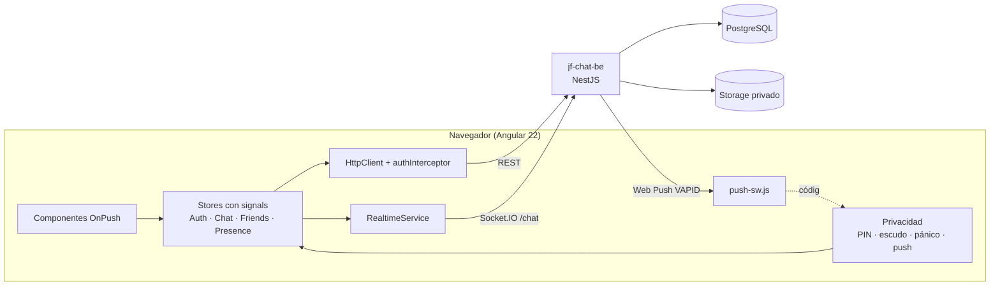

# Velo

**Solo ustedes dos. Nada queda.** Velo es un chat privado para parejas que quieren discreción: los mensajes se autodestruyen en 24 horas, las fotos solo se ven manteniéndolas pulsadas, los avisos no dicen nada y un botón de pánico borra el dispositivo en un segundo.

Hecho con **Angular 22** (signals, zoneless) y **NestJS + Socket.IO + PostgreSQL**, todo en español y pensado primero para el móvil.

- **▶ Demo (sin servidor): https://jfredmc.github.io/jf-chat/demo/**: botón «Entrar con la cuenta demo», o `demo` / `Demo1234`.
- **App real: https://jfredmc.github.io/jf-chat/**: necesita un código de invitación de tu pareja.

> En la demo, la pareja («luna») es simulada y todo vive en tu navegador (`localStorage`). «Reiniciar» lo borra.

[](https://github.com/JFredMC/jf-chat/actions/workflows/ci.yml)
[](https://github.com/JFredMC/jf-chat/actions/workflows/deploy.yml)

## Privacidad, una por una

| | Qué hace |
|---|---|
| **Autodestrucción a las 24 h** | Todo mensaje (y su foto o video) se borra de la base de datos y del almacenamiento 24 h después de enviarse. Un trabajo programado lo hace en el servidor. |
| **«Autodestruir» el chat** | Desde la cabecera o el perfil del contacto, con confirmación: borra la conversación entera y sus archivos para los dos, al instante. |
| **Mensajes efímeros y «ver una vez»** | 1 min, 10 min o 1 h, con cuenta atrás visible. «Ver una vez» se muestra solo mientras lo mantienes pulsado y desaparece 30 s después de leerlo. |
| **Fotos y videos sin guardar** | Nunca se muestran en línea: se mantiene pulsado para verlos a pantalla completa, dibujados en un `<canvas>` (fotos) o sin controles (videos), con una marca de agua `@usuario · fecha hora` de quien mira. Sin menú contextual, sin arrastrar, sin descarga. URLs firmadas de 60 s, pedidas solo al pulsar. |
| **Escudo anticapturas** | El chat se oculta al perder el foco, al pasar a segundo plano, con Imprimir Pantalla / ⌘⇧3-4-5 / Win+Shift+S (y vacía el portapapeles). Imprimir está desactivado. |
| **Bloqueo con PIN** | Pide un PIN de 4 a 8 cifras al abrir y tras 1, 5 o 15 min sin uso. La sesión guardada se cifra con el PIN (PBKDF2 + AES-GCM, WebCrypto). Cinco fallos borran el dispositivo. |
| **Botón de pánico** | Un toque (o Esc tres veces): cierra la sesión en el servidor, quita los avisos y borra todo lo local. Sin confirmación, a propósito. |
| **Avisos sin contenido** | Web Push solo con el primer mensaje tras 6 h de silencio. El aviso muestra un código al azar con un ícono neutro: ni quién, ni qué. |
| **Contactos solo por invitación** | No hay búsqueda de personas: se conecta con un código `XXXX-XXXX-XX` que puedes regenerar. |
| **Cuentas sin datos personales** | Solo usuario y contraseña. Sin nombre, sin correo, sin teléfono. |
| **Ocultar presencia** | «Última conexión» y «escribiendo…» se pueden ocultar. |
| **Modo discreto** | La pestaña, el favicon y la app instalada se llaman «Notas» y nunca muestran no leídos. |
| **Endurecimiento** | CSP estricta, cabeceras de seguridad, límites de peticiones, bloqueo de inicio de sesión tras 5 fallos, access token de 10 min solo en memoria y refresh token rotativo, RLS en la base de datos. |

## Chat

- Burbujas con cola, agrupadas por remitente, con hora y ✓ / ✓✓ / ✓✓ leído.
- Responder citando: botón, doble clic o deslizar a la derecha en el móvil. Tocar la cita lleva al original.
- Selector de emojis (los recientes solo en memoria).
- Perfil del contacto desde la cabecera: estado, desde cuándo son contactos y su configuración de privacidad.
- Tiempo real por Socket.IO con respaldo REST, envío optimista e idempotente, scroll infinito y reconexión sola.

## Arquitectura



- **`core/auth/`**: `AuthStore` (sesión, renovación única y compartida) y `session-vault.ts` (cifrado con el PIN).
- **`core/privacy/`**: `PinLockService`, `ShieldService`, `PanicService`, `PushNotificationsService` y la pantalla de bloqueo.
- **`features/chat/`**: `ChatStore` (hilos, envíos optimistas, efímeros y autodestrucción), visor seguro (`secure-media`), emojis, citas y componentes.
- **`demo/`**: backend simulado con los mismos endpoints, errores y eventos que la API (incluidas la purga de 24 h, el «ver una vez» y la autodestrucción). Solo entra en el build `demo`.

## Stack

| | |
|---|---|
| Frontend | Angular 22 (standalone, signals, zoneless), TypeScript, Tailwind CSS 4, RxJS, socket.io-client, WebCrypto, Web Push |
| Backend | NestJS 11, TypeORM con migraciones, PostgreSQL, Socket.IO, JWT con refresh rotativo, web-push (repositorio `jf-chat-be`) |
| Calidad | ESLint, Vitest, Playwright (escritorio y Pixel 7), GitHub Actions |
| Despliegue | GitHub Pages (app y demo); API en Render; base de datos y archivos en Supabase |

## Ejecutar en local

Requisitos: Node 22 o 24 y Yarn 1.

```bash
yarn install
yarn start:demo            # demo sin backend: http://localhost:4200  →  demo / Demo1234
yarn start                 # contra jf-chat-be en http://localhost:3001
```

## Scripts

| Comando | Qué hace |
|---|---|
| `yarn start` / `yarn start:demo` | Desarrollo con la API real o con la demo |
| `yarn build` · `yarn build:demo` · `yarn build:pages` | Build de producción, de la demo, o lo que se publica en Pages (`dist/pages`) |
| `yarn lint` · `yarn typecheck` · `yarn test` | ESLint, TypeScript y tests unitarios |
| `yarn e2e:demo` | Playwright contra el build de Pages (`DEMO_BASE_URL=… yarn e2e:demo` para la web publicada) |

## Despliegue

`deploy.yml` publica en GitHub Pages en cada push a `main`. Con la variable de repositorio `PAGES_MODE=api`, la raíz es la app real y `/demo/` la demo; con `demo`, la raíz es la demo. **Ramas**: `develop` integra (PRs con CI) y `main` publica.

## Límites honestos

- Una web no puede impedir una captura hecha por el sistema operativo ni una foto con otro teléfono. El escudo y la marca de agua disuaden y dejan rastro de quién miró, pero no bloquean.
- El PIN protege la sesión guardada en este dispositivo, no la cuenta. Un PIN de 4 cifras se puede adivinar con tiempo si alguien copia el almacenamiento del navegador: usa 6 u 8.
- Los avisos necesitan permiso del navegador. En iPhone, solo funcionan con Velo añadido a la pantalla de inicio.
